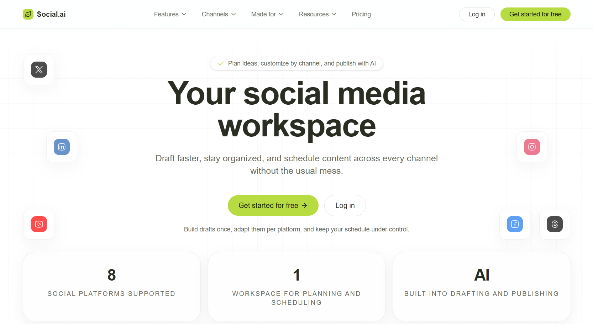

# Social Media Scheduler



A solution-first social media operations platform for creators, teams, and agencies. Turn scattered ideas into scheduled, published, and measured posts without the chaos. Build once, schedule everywhere, and keep every channel aligned.

---

## 🚀 Overview & Features

Social media teams lose momentum when tools are scattered and workflows break. This project consolidates ideation, scheduling, and publishing into one cohesive system. Every feature targets a real pain point: planning, approvals, timing, and consistency.

### Core Capabilities

- **Unified Dashboard:** Manage planning, drafts, and schedules in one place.
- **Multi-channel Publishing:** Connect your social media accounts via secure OAuth flows.
- **AI-Assisted Ideation:** Generate ideas to beat creator block and ensure a constant flow of content.
- **Flexible Views:** Switch between calendar, list, and Kanban-style pipeline for backlog control.
- **Reliable Automation:** Scheduled publishing handled efficiently with Inngest background jobs.
- **Team Collaboration:** Draft, review, publish states, and comment-ready design for seamless teamwork.
- **Global Reach:** Timezone-aware scheduling to target specific audiences globally.
- **Asset Management:** Secure media asset upload and attachment handling.
- **Content Templates:** Reusable content templates for faster creation.

---

## 🛠️ Tech Stack & Architecture

This project is built using modern web development practices and tools, focusing on speed, reliability, and security.

### Frontend
- **Framework:** Next.js (App Router)
- **Language:** TypeScript
- **Styling:** Tailwind CSS, Base UI, Shadcn UI
- **State Management:** React Query for data fetching, Nuqs for URL state

### Backend & Automation
- **Background Cron Jobs:** Inngest (resilient automation and retries)
- **Data & Auth:** Secure OAuth, PKCE flows, encrypted storage
- **Database:** PostgreSQL (with SQL migration support)

### Architecture Highlights
- **Modular Components:** A robust UI library located under `components/`.
- **API & Job Separation:** Clean separation of API routes (client-facing) and Inngest jobs (background tasks).
- **Security First:** Environment variable protection, server-side secrets encryption, and strictly typed SQL models.

---

## 💻 Local Development & Setup

To get this project up and running locally, follow these steps meticulously.

### 1. Prerequisites
Ensure you have the following installed on your machine:
- **Node.js** (v18 or higher)
- **Package Manager:** `npm`, `pnpm`, `yarn`, or `bun`
- **ngrok:** An active account to tunnel local webhooks and OAuth redirects

### 2. Install Dependencies
Clone the repository and install all necessary packages:
```bash
npm install
```

### 3. Environment Variables
Set up your environment variables. Copy the provided `.env.example` file (or create a new `.env` file) and fill in the required values:

```env
# Database Configuration
DATABASE_URL="your-primary-db-connection-string"
DIRECT_URL="your-migration-db-connection-string"

# Backend Services (Insforge or similar)
INSFORGE_URL="your-backend-service-url"
INSFORGE_ANON_KEY="your-anon-key"
INSFORGE_SERVICE_KEY="your-service-key"

# Inngest (Background Jobs)
INNGEST_EVENT_KEY="local"
INNGEST_SIGNING_KEY="local"

# Application Settings
SOCIAL_OAUTH_REDIRECT="https://your-ngrok-url.ngrok.app/api/channel/callback"
NEXT_PUBLIC_APP_URL="http://localhost:3000"
NEXT_PUBLIC_BRAND_NAME="Social Media Scheduler"
```

### 4. Database Migrations
Run your initial database migrations before launching the application to ensure your schema is up to date.

### 5. Start the Application
To run the application with all its services (including background jobs and webhooks), you will need to start three processes concurrently in separate terminal windows:

**Terminal 1: Start Next.js dev server**
```bash
npm run dev
```

**Terminal 2: Expose local server with ngrok**
*(Required for OAuth callbacks and external API webhooks)*
```bash
ngrok http 3000
```

**Terminal 3: Start Inngest Dev Server**
*(Required for processing scheduled publishing jobs)*
```bash
npx inngest-cli@latest dev
```

### 6. Access the App
Open `http://localhost:3000` in your browser. Create an account, connect a channel in the settings area, generate some ideas, and schedule a test post!

---

## 📂 Project Structure

A quick overview of the top-level files and folders you'll see in this project:

- **`app/`** - Next.js App Router containing all pages and API routes. Includes `(dashboard)` and `(landing)` route groups.
- **`components/`** - Reusable React components (UI primitives, custom schedule views, Kanban boards).
- **`inngest/`** - Inngest client configuration and background job functions (`inngest/functions/publish-scheduled-posts.ts`).
- **`lib/`** - Core server utilities, OAuth flows (`lib/social-oauth/`), encryption scripts, and database helpers.
- **`api/`** - Found under `app/api/`. API routes for channel management, idea generation, post CRUD operations, and media uploads.
- **`migrations/`** - SQL scripts containing the database migration history.
- **`types/`** - Shared TypeScript definitions for channels, posts, user profiles, and ideas.
- **`constants/`** - Static configuration files, channel definitions, and metadata.

---

## 🔌 API & Integration Notes

- **OAuth Flows:** Handled securely via the abstract implementations in `lib/social-oauth/`. Ensure your `SOCIAL_OAUTH_REDIRECT` matches your Ngrok tunnel in local development.
- **Background Jobs:** Managed via Inngest. Job logs and statuses can be viewed locally by visiting the Inngest local dashboard (usually port 8288 when running `inngest dev`).
- **Image Uploads:** Upload logic is contained in the dedicated `/api/upload-image` route with security checks.

---

## 🔐 Security & Data Flow

- Server-side utilities are utilized strictly for protecting secrets.
- OAuth flows enforce PKCE for safer authentication exchanges.
- Environment variables dealing with database connections or service keys must never be exposed to the client (i.e., do not prefix them with `NEXT_PUBLIC_`).
- Role-based Access Control (RBAC) and Row Level Security (RLS) can be implemented utilizing the existing SQL model.

---

## 🚀 Deployment Guide

To deploy this platform in a production environment:

1. **Host Frontend:** Deploy the Next.js application to Vercel, Railway, or Render.
2. **Setup Database:** Spin up a managed PostgreSQL instance (e.g., Supabase, Neon) and run your SQL migrations.
3. **Environment Setup:** Copy all your environment variables to your hosting provider's dashboard. Update the `NEXT_PUBLIC_APP_URL` and `SOCIAL_OAUTH_REDIRECT` to match your production domain.
4. **Configure Inngest:** Sync your Vercel (or other host) project with Inngest Cloud to manage and monitor background jobs in production.

---

## 🗺️ Roadmap

We are constantly improving the platform. Here are some of the upcoming features:
- Analytics dashboards with performance notes.
- Multi-step approval workflows and audit trails.
- Cross-channel campaign templates.
- Automatic content recycling and reposting flows.
- Bulk import/export tools.
- Granular Role-Based Access Control (RBAC) for large agency teams.

---

## ❓ FAQ

**Q: Can I add more social networks?**
A: Yes. You can implement new OAuth flows by extending the utilities in `lib/social-oauth/` and adding new channel types in `constants/channels.ts`.

**Q: Is the AI idea generation feature required?**
A: No, it is completely optional. You can manually create content without triggering AI prompts.

**Q: Does this project support teams?**
A: The UI is designed to be team-ready with features like drafts and reviews. You can extend the data layer to support granular team roles.

---

## 🤝 Contributing

We welcome contributions from the community! To contribute:

1. Fork the repository and create a descriptive feature branch.
2. Keep your commits small and focused on a single change.
3. Ensure the UI remains consistent by using the existing primitives in `components/`.
4. Add component or integration tests for any new behavior changes.
5. If adding new integrations, document any new environment variables required.
6. Open a pull request with a clear context and screenshots if UI changes were made.

---

## 📞 Support & Contact

- Use GitHub issues for bug reports and feature requests.
- Provide reproducible steps, expected behavior, and screenshots where possible.
- When reporting issues with scheduled publishing, include the Inngest Job ID for easier debugging.

---

## 📄 License
This project is licensed under the MIT License. See the `LICENSE` file for more details.
